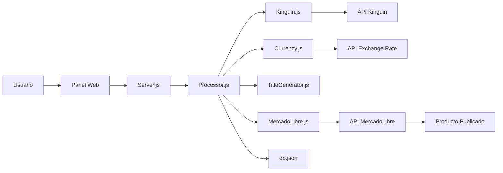

# 📚 DOCUMENTACIÓN COMPLETA

## 📖 Índice de Documentación

Este proyecto incluye varios archivos de documentación para diferentes propósitos:

### 🚀 Para Empezar
- **`RESUMEN.md`** ⭐ - Empieza aquí! Resumen ejecutivo del proyecto
- **`INICIO-RAPIDO.md`** - Guía rápida paso a paso
- **`COMANDOS.md`** - Lista de todos los comandos útiles

### 📘 Documentación Técnica
- **`README.md`** - Documentación completa del proyecto
- **`DEPLOY-DIGITALOCEAN.md`** - Guía completa de despliegue en producción

### 🔧 Archivos de Configuración
- **`config/config.json`** - Configuración principal (credenciales)
- **`.env.example`** - Template de variables de entorno para producción
- **`ecosystem.config.json`** - Configuración de PM2 para producción

### 🛠️ Scripts Útiles
- **`get-token.js`** - Script para obtener Access Token de MercadoLibre
- **`get-token.bat`** - Ejecutable Windows para obtener token
- **`install.bat`** - Instalar dependencias (Windows)
- **`start.bat`** - Iniciar servidor (Windows)
- **`deploy.sh`** - Script de deployment automático (Linux)

---

## 🎯 ¿Qué Leer Primero?

### Si es tu primera vez:
1. **`RESUMEN.md`** - Entender qué es el proyecto
2. **`INICIO-RAPIDO.md`** - Ponerlo en marcha
3. **`COMANDOS.md`** - Comandos que necesitarás

### Si ya lo tienes funcionando:
- **`DEPLOY-DIGITALOCEAN.md`** - Subirlo a producción

### Si tienes problemas:
- **`README.md`** - Sección de troubleshooting
- **`COMANDOS.md`** - Solución de problemas comunes

---

## 🏗️ Arquitectura del Proyecto

```
finalmente/
│
├── 📄 Documentación
│   ├── README.md                    # Documentación completa
│   ├── RESUMEN.md                   # Resumen ejecutivo
│   ├── INICIO-RAPIDO.md             # Guía rápida
│   ├── COMANDOS.md                  # Comandos útiles
│   ├── DEPLOY-DIGITALOCEAN.md       # Guía de deployment
│   └── DOCUMENTACION.md             # Este archivo
│
├── ⚙️ Configuración
│   ├── config/
│   │   └── config.json              # Credenciales y config
│   ├── .env.example                 # Template de variables de entorno
│   ├── ecosystem.config.json        # Config de PM2
│   └── .gitignore                   # Archivos ignorados por Git
│
├── 🎮 Módulos del Sistema (src/)
│   ├── kinguin.js                   # API de Kinguin
│   ├── currency.js                  # Conversión EUR → CLP
│   ├── titleGenerator.js            # Generador de títulos
│   ├── mercadolibre.js              # API de MercadoLibre
│   └── processor.js                 # Orquestador principal
│
├── 🌐 Servidor y Frontend
│   ├── server.js                    # Servidor Express
│   └── public/
│       └── index.html               # Panel de control web
│
├── 💾 Base de Datos
│   └── data/
│       └── db.json                  # Base de datos JSON
│
├── 🔧 Scripts Útiles
│   ├── get-token.js                 # Obtener Access Token
│   ├── get-token.bat                # Script Windows
│   ├── install.bat                  # Instalar (Windows)
│   ├── start.bat                    # Iniciar (Windows)
│   └── deploy.sh                    # Deploy (Linux)
│
└── 📦 Dependencias
    ├── package.json                 # Dependencias Node.js
    └── node_modules/                # Módulos instalados
```

---

## 🔄 Flujo de Datos



---

## 📚 Módulos Explicados

### 1. **kinguin.js** - Módulo de Kinguin
**Función:** Conecta con la API de Kinguin para obtener información de productos.

**Métodos:**
- `getProductById(id)` - Obtiene información de un producto
- `getCheapestPrice(id)` - Busca el precio más barato disponible

**API Endpoint:** `https://gateway.kinguin.net/esa/api/v1`

---

### 2. **currency.js** - Conversión de Moneda
**Función:** Convierte precios de EUR a CLP usando tasas actuales.

**Métodos:**
- `getExchangeRate()` - Obtiene tasa EUR → CLP actual
- `convertEurToClp(eurPrice)` - Convierte precio a CLP
- `applyMarkup(price, markup)` - Aplica margen de ganancia

**API Endpoint:** `https://api.exchangerate-api.com/v4/latest/EUR`

---

### 3. **titleGenerator.js** - Generador de Contenido
**Función:** Crea títulos y descripciones optimizados para MercadoLibre.

**Métodos:**
- `generateTitle(product)` - Crea título (max 60 chars)
- `generateDescription(product)` - Crea descripción completa
- `getMercadoLibreCategory(genre)` - Determina categoría ML

---

### 4. **mercadolibre.js** - API MercadoLibre
**Función:** Publica y gestiona productos en MercadoLibre.

**Métodos:**
- `publishProduct(productData)` - Publica nuevo producto
- `updatePrice(itemId, newPrice)` - Actualiza precio
- `updateStatus(itemId, status)` - Pausa/activa publicación

**API Endpoint:** `https://api.mercadolibre.com`

---

### 5. **processor.js** - Orquestador
**Función:** Coordina todos los módulos y ejecuta el flujo completo.

**Métodos:**
- `processProduct(kinguinId)` - Proceso completo de publicación
- `saveToDatabase(productData)` - Guarda en db.json

**Flujo:**
1. Obtiene info de Kinguin
2. Convierte precio a CLP
3. Genera título/descripción
4. Publica en MercadoLibre
5. Guarda en base de datos

---

## 🔑 Variables de Entorno

### Desarrollo (config.json):
```json
{
  "kinguin": {
    "apiKey": "tu-api-key"
  },
  "mercadolibre": {
    "clientId": "tu-client-id",
    "clientSecret": "tu-secret",
    "accessToken": "tu-token"
  }
}
```

### Producción (.env):
```bash
KINGUIN_API_KEY=tu-key
ML_CLIENT_ID=tu-id
ML_CLIENT_SECRET=tu-secret
ML_ACCESS_TOKEN=tu-token
PORT=3000
NODE_ENV=production
```

---

## 🔒 Seguridad

### Credenciales Sensibles:
- ✅ `config.json` - En `.gitignore` (no se sube a Git)
- ✅ `.env` - En `.gitignore` (no se sube a Git)
- ✅ `tokens.txt` - Se genera local, en `.gitignore`

### Buenas Prácticas:
1. Nunca compartas tus API keys
2. Rota tus tokens regularmente
3. Usa `.env` en producción
4. Configura firewall en el servidor
5. Usa HTTPS en producción

---

## 📊 API Endpoints del Servidor

### Frontend:
- `GET /` - Panel de control web

### API REST:
- `POST /api/process` - Procesar producto por ID
  - Body: `{ "kinguinId": "123" }`
  - Response: `{ "success": true, "product": {...} }`

- `GET /api/products` - Listar productos procesados
  - Response: `[ {...}, {...} ]`

- `DELETE /api/products/:id` - Eliminar producto
  - Response: `{ "success": true }`

### OAuth:
- `GET /auth` - Iniciar autorización ML
- `GET /callback` - Callback OAuth ML

---

## 🧪 Testing

### Probar cada módulo:

```javascript
// Test Kinguin
const kinguin = require('./src/kinguin');
kinguin.getProductById('ID_DE_PRUEBA').then(console.log);

// Test Currency
const currency = require('./src/currency');
currency.convertEurToClp(10).then(console.log);

// Test Title Generator
const titleGen = require('./src/titleGenerator');
console.log(titleGen.generateTitle({ name: 'Game Name', platform: 'PC' }));
```

---

## 📈 Mejoras Futuras

### Corto Plazo:
- [ ] Mejores templates de títulos (SEO optimizado)
- [ ] Auto-renovación del Access Token
- [ ] Validación de datos más robusta

### Mediano Plazo:
- [ ] Base de datos real (MongoDB, PostgreSQL)
- [ ] Sistema de categorías avanzado
- [ ] Actualización automática de precios
- [ ] Webhooks para notificaciones

### Largo Plazo:
- [ ] Dashboard con estadísticas
- [ ] Múltiples marketplaces
- [ ] Sistema de inventario
- [ ] API pública para integraciones

---

## 🆘 Soporte y Recursos

### Documentación de APIs:
- **Kinguin**: https://www.kinguin.net/api-docs
- **MercadoLibre**: https://developers.mercadolibre.cl/
- **Exchange Rate API**: https://exchangerate-api.com/docs

### Tecnologías Usadas:
- **Node.js**: https://nodejs.org/
- **Express**: https://expressjs.com/
- **Axios**: https://axios-http.com/
- **PM2**: https://pm2.keymetrics.io/

### Hosting:
- **DigitalOcean**: https://www.digitalocean.com/
- **MongoDB Atlas**: https://www.mongodb.com/cloud/atlas (futuro)

---

## 📝 Changelog

### v1.0.0 - 2025-10-22
- ✅ Sistema base funcional
- ✅ Integración Kinguin API
- ✅ Integración MercadoLibre API
- ✅ Conversión de moneda en tiempo real
- ✅ Panel web de control
- ✅ Base de datos JSON
- ✅ Scripts de deployment
- ✅ Documentación completa

---

**¿Preguntas? Revisa primero:**
1. RESUMEN.md
2. INICIO-RAPIDO.md
3. README.md
4. Este archivo

**¡Buena suerte con tu proyecto! 🚀**
